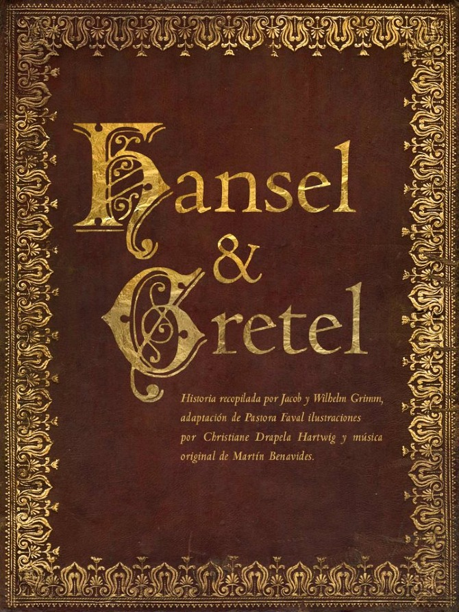
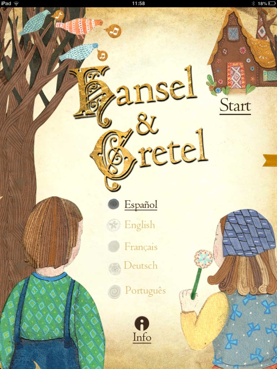
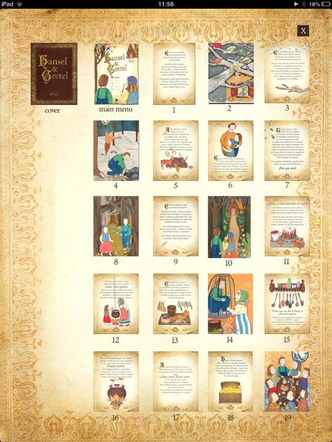
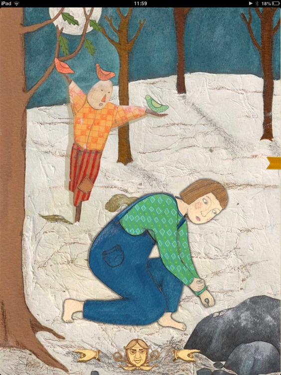
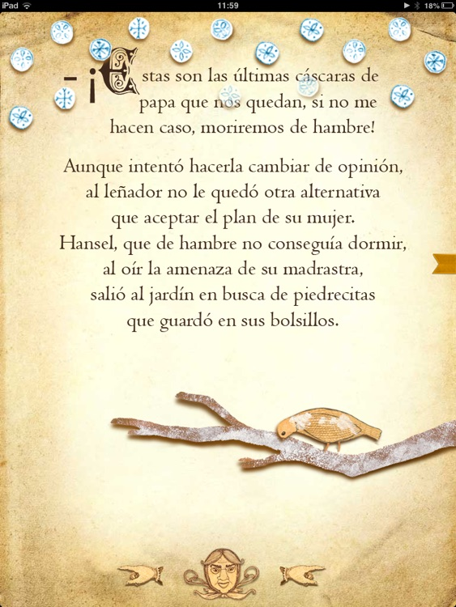

# Hansel and Gretel

- [Hansel and Gretel](#hansel-and-gretel)
  - [Book Menu](#book-menu)
  - [Book Index Page](#book-index-page)
  - [Book Page](#book-page)
  - [Book Page](#book-page-1)
  - [Music](#music)
- [how to run it](#how-to-run-it)

 \

Transform your iPad into a window to the sweet world of "Hansel & Gretel", the classic fairy tale by the Brothers Grimm, now with narration and made interactive on your iPad
Hansel & Gretel Miel Producciones
by Miel Producciones
Transform your iPad into a window to the sweet world of "Hansel & Gretel", the classic fairy tale by the Brothers Grimm, now with narration and made interactive on your iPad. Developed for kids of all ages.

Transform your iPad into a window to the sweet world of "Hansel & Gretel", the classic fairy tale by the Brothers Grimm, now with narration and made interactive on your iPad. Developed for kids of all ages.

Find within beautiful interactive illustrations, especially composed music in tune with the mood of the progress you make in the story, and amusing animations, all of which will create a wonderful experience for you and your family.

With multiple available languages to choose from, both for text and narration, not only is this the best version of this story to share with children, but also an ideal way to help teach them another language, thanks to the ability to instantly switch between languages and read the story again as many times as you like in any language you prefer.

Will you open the sugary window?

-

Available Languages: English, Spanish, French, Portuguese and German. Available for text and narration.

This story was originally compiled by Jacob and Wilhelm Grimm, librarians and philologists originating from Hanau, Hessen, Germany. Their first publication was in 1812, 200 years ago, in two volumes called "Stories for Children and the Home" or "Kinder und Hausmärchen".

The text for the story was adapted by Pastora Faval, along with the wonderful illustrations of Christiane Drapela, and the music of Martin Benavides based on a variation of the theme "Ein Männlein Steht Im Walde", making this version of Hansel & Gretel ideal for those of whom reading is not enough, but also enjoy living a story.

## Book Menu

 \

## Book Index Page

 \

## Book Page

 \

## Book Page

 \

## Music

!audio[Hansel and Gretel ](gretel_hansel/src/assets/audio/mmt_menu.mp3)

# how to run it
